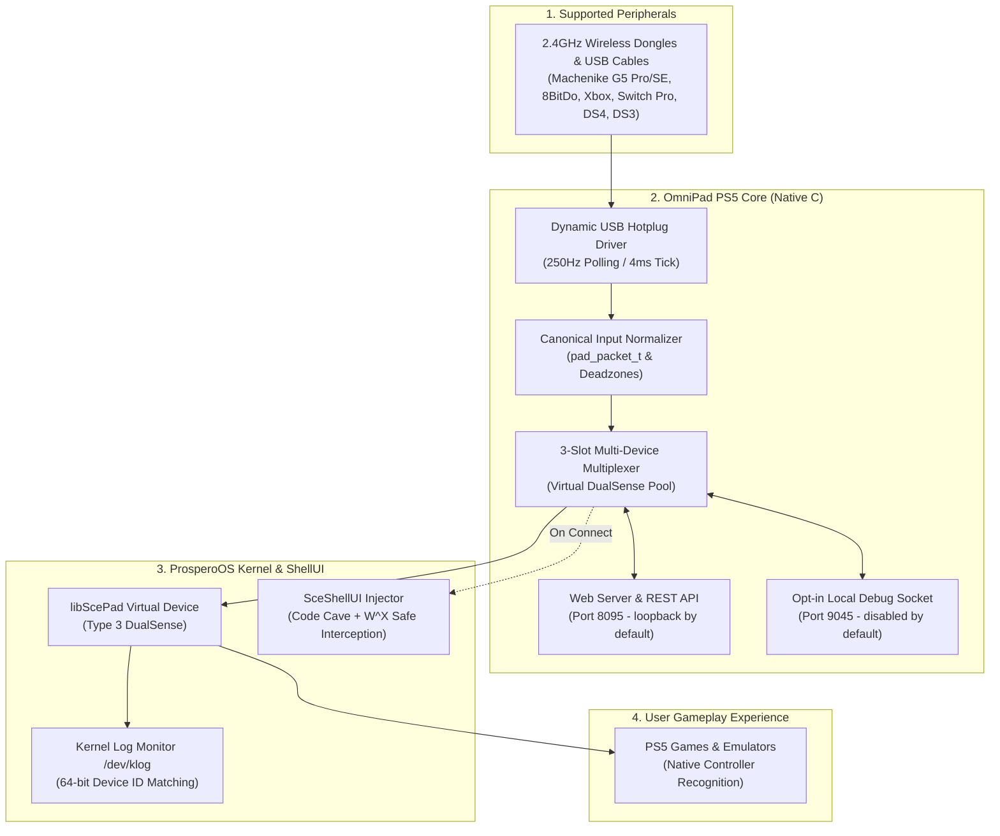

# OmniPad PS5 🎮🚀
### Universal Controller Engine & Web Control Center for PlayStation 5 (FW 7.00 – 13.60)

[-00b4d8?style=for-the-badge)](docs/FIRMWARE_1360_GUIDE.md)

> ### ⚖️ Legal Disclaimer & Fair Use Notice
> This is an independent open-source research project developed strictly for **educational, accessibility, and hardware interoperability purposes** (allowing third-party controllers and adaptive peripherals to function on the console).
> 
> - **No Proprietary Code:** This repository contains no proprietary Sony Interactive Entertainment code, no game DRM circumvention, and no cryptographic keys. It builds against the open-source community SDK (`ps5-payload-sdk`).
> - **Nominative Fair Use:** "PlayStation", "PS5", "DualSense", "DualShock", "Xbox", "Nintendo", and any other product names or trademarks mentioned belong exclusively to their respective holders. They are used purely for descriptive and compatibility identification purposes under nominative fair use.

---

## 📌 Motivation & The Origin Story

> 💬 *"Honestly? This whole project started because I was just a guy who wanted his **Machenike G5 Pro Max SE** controller working on his PS5."*

I wanted to play 3-player and 4-player local games on my jailbroken PS5 (running FW 13.60 with `kstuff` and `shadowmountplus`). However, existing community tools either lacked 2.4GHz USB dongle hotplug support or broke on FW 13.60's user profile assignment screen (`0x803B0006`).

**OmniPad PS5** is the result of solving that exact problem: building a low-level C subsystem for jailbroken PlayStation 5 consoles that provides **dynamic 250Hz USB Hotplug** (4ms polling) for 2.4G dongles and wired cables, while safely bypassing the profile assignment block.

---

## 🙏 Standing on the Shoulders of Giants (Credits & Origins)

This project is an open-source consolidation, enhancement, and evolution built directly upon pioneering research and code shared by talented developers across the PS5 homebrew community. Sincere gratitude and foundational credit belong to:

- 🎮 **sinfiltros**: Creator of [AnyPad-PS5](https://github.com/sinfiltros/AnyPad-PS5) — laid the groundwork for `libScePad` virtual DualSense emulation and native Bluetooth HCI/L2CAP research.
- 🔌 **StonedModder / a-ddr**: Authors of [PoorDS4](https://github.com/a-ddr/PoorDS4) and Ghostcontrol — provided vital reference implementations for USB HID parsing, controller wake-up handshakes (Switch Pro, DS3), and asynchronous FreeBSD `/dev/ugen` polling.
- 💉 **MegaCadeDev**: Author of [YetAnotherControllerEnabler](https://github.com/MegaCadeDev/YetAnotherControllerEnabler) — pioneering research into `SceShellUI` ptrace code cave injection to overcome the `0x803B0006` profile assignment screen.
- 🛠️ **ChendoChap, SpecterDev, flatz & ps5-payload-sdk contributors**: Authors of the `ps5-payload-sdk`, `kstuff`, and kernel debugging tools making native C payloads possible.
- 🚀 **LightningMods & etaHEN Team**: For their tireless dedication to the PS5 homebrew ecosystem.

---

## 🏛️ Architecture

---

## 🌟 Key Features

| Feature | Details |
|---|---|
| **Dynamic USB Hotplug (250Hz)** | Plug & play any 2.4G dongle or USB cable on the fly (4ms tick latency). |
| **Bypass Error `0x803B0006`** | Non-destructive `ptrace` code cave in `SceShellUI` respecting W^X protections. |
| **Multi-Player (Up to 4 Players)** | 3 virtual DualSense slots (Players 2–4) + 1 official DualSense (Player 1). |
| **Dynamic Bus Discovery** | Automatically scans `/dev/ugen*.*` nodes across PS5 Fat, Slim (CFI-2000), and Pro (CFI-7000). |
| **Embedded Web Dashboard** | Dark UI dashboard on port 8095. It binds to loopback by default; authenticated LAN access can be enabled with a local token file. |
| **Local Debug Input** | TCP input on port 9045 is compiled out by default. Development builds can opt in, and the listener binds only to loopback. |

---

## 🕹️ Controller Compatibility & Hardware Testing Status (v1.0.4)

> 🔬 **Developer Hardware Testing Disclosure:**
> OmniPad PS5 is maintained by an independent solo developer. Currently, the developer physically owns and tests on a **Machenike G5 Pro Max SE** (2.4GHz USB Dongle & USB-C Cable).
> 
> Support for **Xbox Series X\|S, Xbox One, DualShock 4, DualShock 3, and Switch Pro** was written based on official USB HID/GIP specifications, reference open-source drivers, and automated test suites. Because physical hardware was not on the developer's test bench during initial release, **these decoders are currently considered EXPERIMENTAL**. If you own these controllers, your testing reports and feedback are warmly welcomed to help fine-tune and verify them!

> ⚠️ **Important Connection Notice (v1.0.4):**
> OmniPad PS5 v1.0.4 operates **exclusively via USB ports** (physical USB cables and supported 2.4GHz USB wireless dongles). **Direct wireless Bluetooth pairing through the console's internal antenna is currently in active development for v1.1.0 and is NOT active in v1.0.4.**

| Controller Brand | Supported Connection (v1.0.4) | Hardware Testing Status | Notes |
|---|---|:---:|---|
| **Machenike G5 Pro / G5 Pro Max SE** | Bundled 2.4GHz USB Dongle or USB-C Cable | 🟢 **Verified on PS5 Hardware** | Fully tested & verified in real 3-player gameplay on FW 13.60. Plug & play at 250Hz. |
| **Microsoft Xbox Series X\|S & Xbox One** | Physical USB-C / Micro-USB Cable **OR** 8BitDo USB Adapter | 🟡 **Experimental (Spec-Implemented)** | Decodes GIP `0x20` input & `0x07` Guide packets via wired USB. *(Needs community testing on console)*. |
| **Microsoft Xbox 360** | Wired USB Cable (`045e:028e`) | 🟡 **Experimental (Spec-Implemented)** | XInput wired report parser implemented. |
| **Sony DualShock 4** | Physical Micro-USB Cable | 🟡 **Experimental (Spec-Implemented)** | 64-byte USB HID parser implemented. *(Direct BT in v1.1.0)*. |
| **Sony DualShock 3 (PS3)** | Physical Mini-USB Cable | 🟡 **Experimental (Spec-Implemented)** | USB magic wake packet (`0x03f4`) implemented. *(No Bluetooth)*. |
| **Nintendo Switch Pro** | Physical USB-C Cable | 🟡 **Experimental (Spec-Implemented)** | 3-step USB activation handshake implemented. *(Direct BT in v1.1.0)*. |
| **8BitDo Wireless USB Adapter (v1 / v2)** | USB 2.4G Dongle | 🟡 **Experimental (Spec-Implemented)** | Bridges wireless controllers into USB HID/XInput. |
| **Generic PC USB Gamepads** | Standard USB Cable (HID / XInput) | 🟡 **Experimental (Spec-Implemented)** | Standard 10-byte HID normalization. |

---

### 🔍 Transparent Clarifications: Microsoft Xbox Controllers
To avoid any confusion or unmet expectations, please note the exact state of Xbox hardware support:
1. **Direct Bluetooth Pairing:** **NOT supported in v1.0.4.** Xbox One / Series X\|S controllers communicate via Bluetooth Low Energy (BLE) requiring SMP AES-128 cryptographic pairing over the console's internal radio. This stack is actively being finalized for **v1.1.0**.
2. **Official "Xbox Wireless Adapter for Windows" (Microsoft Dongle):** **NOT supported.** The official Microsoft PC dongle uses a proprietary Wi-Fi Direct / GIP protocol that is not recognized by the FreeBSD/ProsperoOS USB driver.
3. **How to use Xbox Controllers Today in v1.0.4:**
   - **Option A (Wired):** Connect via a **data-capable** USB-C (Series X\|S) or Micro-USB (Xbox One) cable directly to any PS5 USB port. *(Ensure your cable has data lines; charge-only cables will not transmit inputs).*
   - **Option B (Wireless via Third-Party USB Adapter):** Pair your Xbox controller to an **8BitDo Wireless USB Adapter 2** plugged into the PS5. The 8BitDo adapter bridges the wireless signal into standard USB inputs.

---

### ⚠️ What to Expect & What NOT to Expect in v1.0.4

- ❌ **No Direct Console Bluetooth Yet:** You cannot currently put a controller into Bluetooth sync mode and connect directly to the PS5 without a USB cable or USB adapter. (Coming in v1.1.0).
- ❌ **No Gyroscope / Motion Controls:** IMU sensors (accelerometer/gyro) report neutral values. Games strictly requiring motion controls must use the official DualSense on Player 1.
- ❌ **No DualSense Adaptive Triggers / Haptics:** Non-DualSense controllers do not have Sony's proprietary force-feedback trigger motors. Standard rumble is handled natively where supported.
- ❌ **No Multi-touch Touchpad Surface:** The touchpad is mapped as a single digital click (used by games to open maps or menus).
- ℹ️ **Player 1 vs Virtual Slots:** OmniPad emulates **Players 2, 3, and 4** (3 virtual DualSense slots). The primary console user (Player 1) uses the official physical DualSense.

*For full technical details and VID:PID tables, see [docs/COMPATIBILITY.md](docs/COMPATIBILITY.md).*

---

## 🚀 Quick Start & Usage Tutorial

> 💡 **Pre-compiled Binary:** You do **not** need to compile anything from source. Download the ready-to-run `OmniPad-PS5.elf` directly from the [**GitHub Releases**](../../releases) tab (**v1.0 Beta Test**).

---

### Step 1: Load the Payload
Send `OmniPad-PS5.elf` to your console using your preferred ELF loader or payload sender.

*(A system notification will appear on the top right of your screen: `OmniPad PS5 v1.0.4 Ativo! Painel: porta 8095`)*

---

### Step 2: Connect Your Controller
- **2.4GHz Dongles & USB Cables (Instant Plug & Play in v1.0.4):**
  Plug your USB dongle (e.g. **Machenike G5 Pro Max SE**, 8BitDo Wireless Adapter) or USB cable (DualShock 4, DualShock 3, Xbox, Switch Pro, etc.) into any front or rear USB port. The 250Hz hotplug driver recognizes it automatically within milliseconds.
- **Direct Internal Bluetooth Wireless (In Development — Planned for v1.1.0):**
  Direct wireless pairing via the console's internal Bluetooth antenna (`bt_hci_usb`) is actively being finalized and will be exposed in the Web UI in the **v1.1.0** update. In v1.0.4, please use a USB cable or a wireless USB adapter/dongle (such as 8BitDo or manufacturer 2.4G dongles).

---

### Step 3: Assign User Profile (Bypassing Error `0x803B0006`)
On firmwares like **13.60** (with `kstuff-1.13-fpkg-dr-test5` & `shadowmountplus v1.7 Beta 4`), profile assignment is automated via safe `SceShellUI` code caves:
1. Press the **PS / Home button** on your controller (or click **"Simulate PS Button"** in the Web Dashboard).
2. The official PS5 profile selection menu will appear on screen.
3. Choose the desired user profile for Player 1, 2, 3, or 4.

---

### Step 4: Live Web Dashboard (Port 8095)

The default dashboard binds to loopback at `http://127.0.0.1:8095/`. To use it from another device on the LAN, enable authenticated LAN mode by installing a random token at `/data/anypad/web.token` with file mode `0600`, then restart the payload. See [docs/NETWORK_SECURITY.md](docs/NETWORK_SECURITY.md) for setup and endpoint access rules.

In LAN mode, the page accepts the token in its **LAN access token** field. It keeps the token in the current browser tab's session storage. Status remains read-only and public; logs and state-changing API requests require the bearer token. The server does not grant cross-origin access.

- 🎮 **Slot Status:** Real-time visibility of all 4 player slots (connected gamepads and connection types).
- ⚡ **Power Telemetry:** Live power status (`⚡ USB Cable / 5V` for wired controllers and dongles).
- 🔘 **Simulate PS Button:** Remotely trigger the PS button to change accounts or open the system menu.
- 🔄 **Disconnect Slot:** Free any individual slot instantly without unplugging hardware.

---

## 📚 Technical Documentation

- [docs/COMPATIBILITY.md](docs/COMPATIBILITY.md) — Detailed controller compatibility and mappings.
- [docs/FIRMWARE_1360_GUIDE.md](docs/FIRMWARE_1360_GUIDE.md) — FW 13.60 architecture, Relapse exploit, and code cave injection details.
- [docs/HOW_IT_WORKS.md](docs/HOW_IT_WORKS.md) — In-depth breakdown of USB hotplug and virtual pad lifecycle.
- [docs/NETWORK_SECURITY.md](docs/NETWORK_SECURITY.md) — Dashboard access modes, token setup, debug input, and host-test commands.

---

## 📜 Credits & Acknowledgments

Licensed under the **GNU GPL v3.0**.

Fundamental credits to the community pioneers whose work inspired and paved the way:
- **sinfiltros**: Author of [AnyPad-PS5](https://github.com/sinfiltros/AnyPad-PS5) for the native Bluetooth HCI/L2CAP stack.
- **StonedModder / a-ddr**: Developers of [PoorDS4](https://github.com/a-ddr/PoorDS4) and Ghostcontrol for USB HID decoding and handshakes.
- **MegaCadeDev**: Author of [YetAnotherControllerEnabler](https://github.com/MegaCadeDev/YetAnotherControllerEnabler) for SceShellUI injection insights.
- The **ps5-payload-sdk**, **etaHEN**, and **kstuff** research teams.
