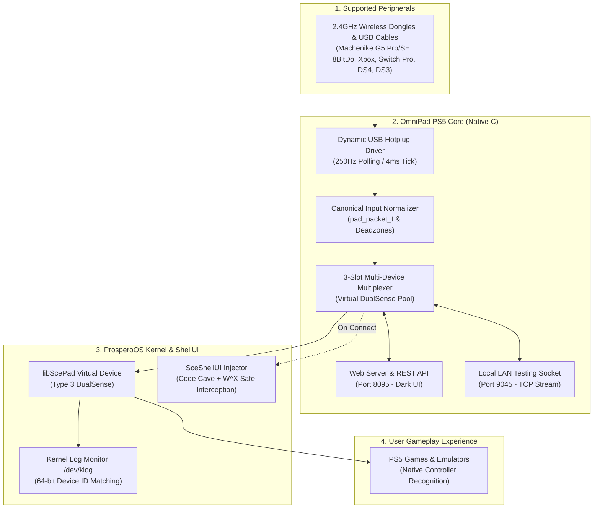

# OmniPad PS5 🎮🚀
### Universal Controller Engine & Web Control Center for PlayStation 5 (FW 7.00 – 13.60)

[](docs/FIRMWARE_1360_GUIDE.md)
[-00b4d8?style=for-the-badge)](docs/FIRMWARE_1360_GUIDE.md)
[](src/)
[](LICENSE)

> ### ⚖️ Legal Disclaimer & Fair Use Notice
> This is an independent open-source research project developed strictly for **educational, accessibility, and hardware interoperability purposes** (allowing third-party controllers and adaptive peripherals to function on the console).
> 
> - **No Proprietary Code:** This repository contains no proprietary Sony Interactive Entertainment code, no game DRM circumvention, and no cryptographic keys. It builds against the open-source community SDK (`ps5-payload-sdk`).
> - **Nominative Fair Use:** "PlayStation", "PS5", "DualSense", "DualShock", "Xbox", "Nintendo", and any other product names or trademarks mentioned belong exclusively to their respective holders. They are used purely for descriptive and compatibility identification purposes under nominative fair use.

---

## 📌 Overview

**OmniPad PS5** is a native C low-level controller subsystem and multiplexer for jailbroken PlayStation 5 consoles.

It unifies direct wireless **Bluetooth** (via the console's internal HCI/L2CAP chip) and **dynamic 250Hz USB Hotplug** (for 2.4GHz wireless dongles and USB cables), while resolving the user profile assignment block (`0x803B0006`) on modern firmwares up to **FW 13.60** (tested and verified on `kstuff-1.13-fpkg-dr-test5` and `shadowmountplus v1.7 Beta 4`).

### 💡 Motivation
Created to solve a real hardware pain point: connecting a 3rd player controller (a **Machenike G5 Pro Max SE** with a 2.4GHz USB dongle) on **PS5 FW 13.60** running **kstuff-1.13-fpkg-dr-test5** and **shadowmountplus v1.7 Beta 4**. Existing tools either lacked USB 2.4G hotplug support or failed during user assignment on newer firmwares. OmniPad PS5 bridges these gaps into a single, cohesive engine.

---

## 🏛️ Architecture



---

## 🌟 Key Features

| Feature | Details |
|---|---|
| **Dynamic USB Hotplug (250Hz)** | Plug & play any 2.4G dongle or USB cable on the fly (4ms tick latency). |
| **Bypass Error `0x803B0006`** | Non-destructive `ptrace` code cave in `SceShellUI` respecting W^X protections. |
| **Multi-Player (Up to 4 Players)** | 3 virtual DualSense slots (Players 2–4) + 1 official DualSense (Player 1). |
| **Dynamic Bus Discovery** | Automatically scans `/dev/ugen*.*` nodes across PS5 Fat, Slim (CFI-2000), and Pro (CFI-7000). |
| **Embedded Web Dashboard** | Dark UI dashboard on port 8095 for real-time slot status, battery monitoring, and manual controls. |
| **LAN Test Port** | Inject test frames over TCP port 9045 without needing physical hardware connected. |

---

## 🕹️ Supported Controllers

- **Machenike:** G5 Pro / G5 Pro Max SE (2.4GHz Dongle & USB Cable).
- **8BitDo:** Wireless USB Adapter v1/v2, Ultimate Bluetooth/2.4G, SN30 Pro, Pro 2.
- **Microsoft:** Xbox Series X|S, Xbox One, Xbox Elite 2, Xbox 360 (USB and BT BLE with SMP crypto).
- **Nintendo:** Switch Pro Controller (USB & Bluetooth with SPI calibration and handshakes).
- **Sony:** DualShock 4 (v1 and v2), DualSense / Edge, DualShock 3 (USB with magic wake packet).
- **Generic:** Any standard PC USB / HID gamepads (Logitech, EasySMX, GameSir, etc.).

*For the comprehensive compatibility table, see [docs/COMPATIBILITY.md](docs/COMPATIBILITY.md).*

---

## 🚀 Quick Start & Usage Tutorial

> 💡 **Pre-compiled Binary:** You do **not** need to compile anything from source. Download the ready-to-run `OmniPad-PS5.elf` directly from the [**GitHub Releases**](../../releases) tab (**v1.0 Beta Test**).

---

### Step 1: Load the Payload
Send `OmniPad-PS5.elf` to your console using your preferred ELF loader or payload sender.

*(A system notification will appear on the top right of your screen: `OmniPad PS5 v1.0.4 Ativo! Painel: porta 8095`)*

---

### Step 2: Connect Your Controller
- **2.4GHz Dongles & USB Cables (Instant Plug & Play):**
  Plug your USB dongle (e.g. **Machenike G5 Pro Max SE**, 8BitDo) or USB cable into any front or rear USB port. The 250Hz hotplug driver recognizes it automatically within milliseconds.
- **Bluetooth Wireless:**
  Open the Web Dashboard (see Step 4) and click **"Pair Controller"** to start the 60-second pairing window. Put your controller in pairing mode (`Share + PS` on DualShock 4, `Sync` button on Switch Pro or Xbox).

---

### Step 3: Assign User Profile (Bypassing Error `0x803B0006`)
On firmwares like **13.60** (with `kstuff-1.13-fpkg-dr-test5` & `shadowmountplus v1.7 Beta 4`), profile assignment is automated via safe `SceShellUI` code caves:
1. Press the **PS / Home button** on your controller (or click **"Simulate PS Button"** in the Web Dashboard).
2. The official PS5 profile selection menu will appear on screen.
3. Choose the desired user profile for Player 1, 2, 3, or 4.

---

### Step 4: Live Web Dashboard (Port 8095)
Open the control center from any smartphone, PC, or console browser on your local network:

```
http://<PS5_IP>:8095/
```

- 🎮 **Slot Status:** Real-time visibility of all 4 player slots (connected gamepads and connection types).
- 🔋 **Battery Monitoring:** Live battery percentage and charging indicator.
- 🔘 **Simulate PS Button:** Remotely trigger the PS button to change accounts or open the system menu.
- 🔄 **Disconnect Slot:** Free any individual slot instantly without unplugging hardware.

---

## 📚 Technical Documentation

- [docs/COMPATIBILITY.md](docs/COMPATIBILITY.md) — Detailed controller compatibility and mappings.
- [docs/FIRMWARE_1360_GUIDE.md](docs/FIRMWARE_1360_GUIDE.md) — FW 13.60 architecture, Relapse exploit, and code cave injection details.
- [docs/HOW_IT_WORKS.md](docs/HOW_IT_WORKS.md) — In-depth breakdown of USB hotplug and virtual pad lifecycle.

---

## 📜 Credits & Acknowledgments

Licensed under the **GNU GPL v3.0**.

Fundamental credits to the community pioneers whose work inspired and paved the way:
- **sinfiltros**: Author of [AnyPad-PS5](https://github.com/sinfiltros/AnyPad-PS5) for the native Bluetooth HCI/L2CAP stack.
- **StonedModder / a-ddr**: Developers of [PoorDS4](https://github.com/a-ddr/PoorDS4) and Ghostcontrol for USB HID decoding and handshakes.
- **MegaCadeDev**: Author of [YetAnotherControllerEnabler](https://github.com/MegaCadeDev/YetAnotherControllerEnabler) for SceShellUI injection insights.
- The **ps5-payload-sdk**, **etaHEN**, and **kstuff** research teams.
